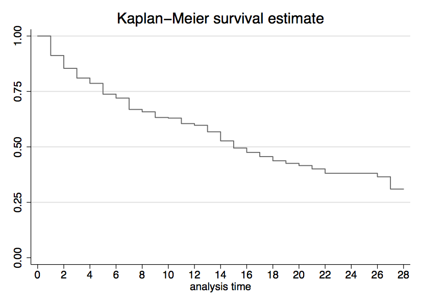
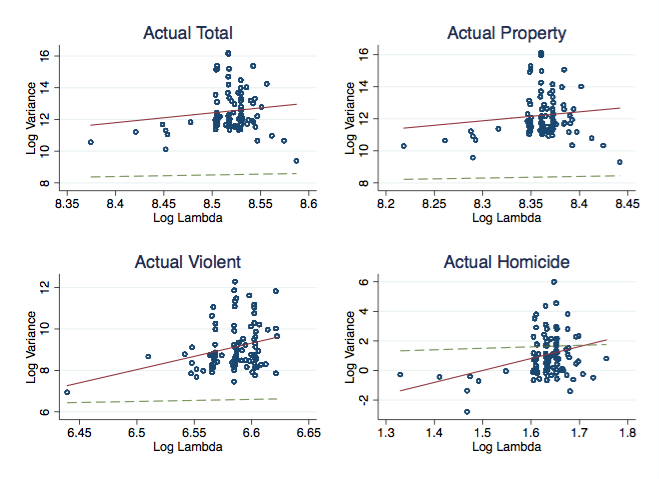

% Title Presentation
% Jakob Schwerter
% Whatever, Tilburg University


Random Thoughts
================
Seeing the sun shining
---------------------
- Why do I not enjoy the sun, while sitting in the library? 
- I mean, I have to work and cannot enjoy the sun.
- Maybe, because I have an aim I follow and there is not much which can actually distract me from that aim.
- Based on the fact that I have to work on the library, it is nicer to see the sun shining.
 	- Clear reason to get a spot at a window btw. 


---------------------

More Cheese = Less Cheese
---------------------

- More Chesse = More Holes
- More Holes = Less Cheese
- More Cheese = Less Cheese

just saying...


Question 1
================

subquestion a
----------

<span>eststo: reg lnc lnp lny, cluster(state)</span>\
Results can be seen in Table 1

--------

subquestion b(1)
----------

<span>quietly tab year, gen(period)</span>\
<span>eststo: xtreg lnc lnp lny period\*,fe cluster(state)</span>\
<span>eststo: reg d.lnc d.lnp d.lny d.period\*, cluster(state)</span>\
<span>xtserial lnc lnp lny</span>\
$$\begin{align*}
lnC_{it}= \alpha + \beta_{1}lnP_{it} + \beta_{2}lnY_{it} + \gamma_{2} D_{2i}+... + \\ \gamma_{46} D_{46i}+ \delta_{1} T1_{t} + ...+ \delta_{29} T29_{t}+u_{it}\end{align*}$$
- Model of interest


subquestion b(2)
-----------------

- In order to account for time effects dummy variables (T1-T29) for each but one year are included. 

- To include state effects there are several
options. 
- Firstly dummy variables (D2-D46) for each state can be added to
the regression. 
- Equivalently, a fixed effect within transformation can
be applied to get rid of unobserved state-specific effects. 

--------


- If the
state-specific effects can be argued to be uncorrelated with the
included regressors, a random effects model can be estimated. 

- In fact,
the Hausmann test does no reject the RE model. 
- Since the RE model yields
very similar estimates we will stick with the FE model for comparative
purposes.


subquestion b(3)
-----------------
- Given that smoking is an addiction it is plausible that there might be
serial correlation. 
	- confirmed by a test for serial correlation
in the residuals obtained from the FD regression. 
- Given substantial
serial correlation, the FD regression should generally be preferred.

--------

I guess it is okay to make the presentation a bit shorter than the normal file


Question 2
==========

Some Math
----------


$$\begin{align*}
& E[y_{i} | a^{l}_{i}=0, s_{i}=0] = \alpha - \gamma \frac{\pi_{0}}{\pi_{2}}\\
& E[y_{i} | a^{l}_{i}=0, s_{i}=1] = \alpha - \gamma \frac{\pi_{0}}{\pi_{2}} + \beta - \frac{1}{\pi_{2}} (\gamma \pi_{1} + \tau (\pi_{0}+\pi_{1}) ) \\
& E[y_{i} | a^{l}_{i}=1, s_{i}=0] = \alpha - \gamma \frac{\pi_{0}}{\pi_{2}}+\frac{\gamma}{\pi_{2}}\\
& E[y_{i} | a^{l}_{i}=1, s_{i}=1] = \alpha + \beta - \frac{1}{\pi_{2}}(\gamma (\pi_{0}+(\pi_{1}-1)+\tau(\pi_{0}+\pi_{1}-1))\\
\end{align*}$$

More Math
--------------

$$\begin{align*}
& E[y_{i} | a^{l}_{i}=0, s_{i}=1] - E[y_{i} | a^{1}_{i}=0, s_{i}=0]  = \beta - \gamma \frac{\pi_{1}}{\pi_{2}}-\frac{\tau}{\pi_{2}}(\pi_{0}+\pi_{1}) \\
& \text{If }\pi_{0} = \pi_{1} = 0, \\
& E[y_{i} | a^{l}_{i}=0, s_{i}=1] - E[y_{i} | a^{1}_{i}=0, s_{i}=0]  = \beta - \gamma \frac{0}{\pi_{2}}-\frac{\tau}{\pi_{2}}(0+0) = \beta \\
\end{align*}$$

Even More Math
-----------

Partial derivatives of the expenditure function with respect to prices\
$$\begin{align*}
&h_{1}(p,u) = \frac{{\partial}e(p,w)}{{\partial}{p_{1}}} = \frac{u}{2} \\
&h_{2}(p,u) = \frac{{\partial}e(p,w)}{{\partial}{p_{2}}} = u \\
&\rightarrow  h(p,u) = \left(\begin{array}{c}  \frac{u}{2} \\ u \end{array} \right)\end{align*}$$


Figures
=================

--------------

Because figures are fun.

Checkout the different width's ;)


--------------

Figure 1
-----------

{width="60.00000%"}


--------------

Figure 2
-----------

{width="40.00000%"}


---------------------------------------------

- we can also do a figure from the web
	- But I actually prefer a funny meme
		- Because I like them
- Cool, different types of points for nested bullets
	- Nice

---------------------------------------------

Figure 3
-----------

{width="50.00000%"}

-------------------------------------

{width="50.00000%"}


Conclusion
==========

--------------

I hope we did not have to contruct a presentaiton which makes completely sense

I keep the following to know the codes for an easy copy and past:

-------------------------------------


- to get the html, type the following on one line:


```
pandoc -s --mathjax --slide-level 2 --toc --toc-depth=1 -t revealjs presentation.md -V theme=solarized -o index.html
```
- if you want a beamer/latex pdf, type:

```
pandoc --slide-level 2 --toc --toc-depth=1 -t beamer presentation.md -V theme:Montpellier -o presentation.pdf
```
